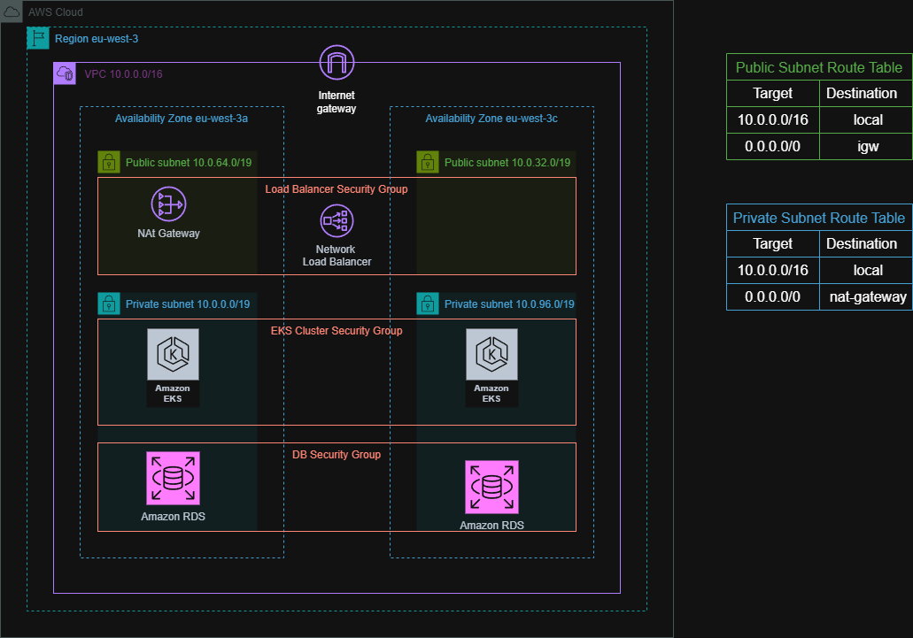

# Overview
This is an example of how to provision an AWS EKS (Elastic Kubernetes Service) and RDS database using Terraform and an AWS free tier account. This description does not aim to give a deep explanation of the various components of the infrastructure, but a simple rundown of what is implemented and why.
Run-down of the infrastructure elements created:
- VPC
- Four subnets
- Internet Gateway
- Nat Gateway
- Routing tables
- Network loadbalancer
- EKS (with auto scaling group)
- RDS database (postges)

Infrastructure diagram:

## Modules description
### Networking
Here, we create all the necessary network components to support our EKS cluster:
- VPC
- Four Subnets
- Internet Gateway
- Nat Gateway
- Routing tables

EKS requires you to provide multiple subnets in at least two different availability zones. In this example, I've created a VPC (virtual private cloud) in two availability zones with two subnets each, one private and one public. We use the private networks to deploy the EKS's nodes and provision the RDS database, and in the public networks we provision a `Network Load Balancer`.

An `internet gateway` is created and attached to our VPC. This is used to provide internet access to any instance with a public address located in a public subnet.

We also create a `NAT Gateway` this is used to translate private IP addresses into public ones, allowing internet access within private subnets and preventing the internet from establishing connections with the private resources.

### EKS_cluster
In this module, we provision the EKS and the respective node group. We also provision the needed `eks-pod-identiy-agent` addon. Some of the k8s addons present in k8s_addons module need permissions to interact with AWS (ex: cluster autoscaler). `eks-pod-identiy-agent` addon allows us to easily give permissions to a Kubernetes service account by attaching an AWS IAM role to it via the `aws_eks_pod_identity_association` resource.

### EKS_K8s_addons
Here we install the following k8s addons:
- nginx-ingress-controller
- aws-load-balancer-controller
- cluster-autoscaler
- secrets-store-csi-drive
- secrets-store-csi-driver-provider-aws
- cert-manager

`nginx-ingress-controller` is our ingress controller, and  `aws-load-balancer-controller` is used to provision external AWS network load balancers via Kubernetes resources.
`cluster-autoscaler` its in the name, it auto-scales the cluster when full by creating more nodes for new pods to be scheduled.
`secrets-store-csi-drive` addon is used to integrate secrets with many different cloud providers. In our case, we want to integrate our Kubernetes secrets with AWS Secret Store Manager. So we also need to install `secrets-store-csi-driver-provider-aws`.
`cert-manager` automaticaly request a TLS certificate from letsencrypt

### RDS
Here, we create an RDS  in our private subnet group and its respective security group with an ingress rule to allow access within our VPC.

  

